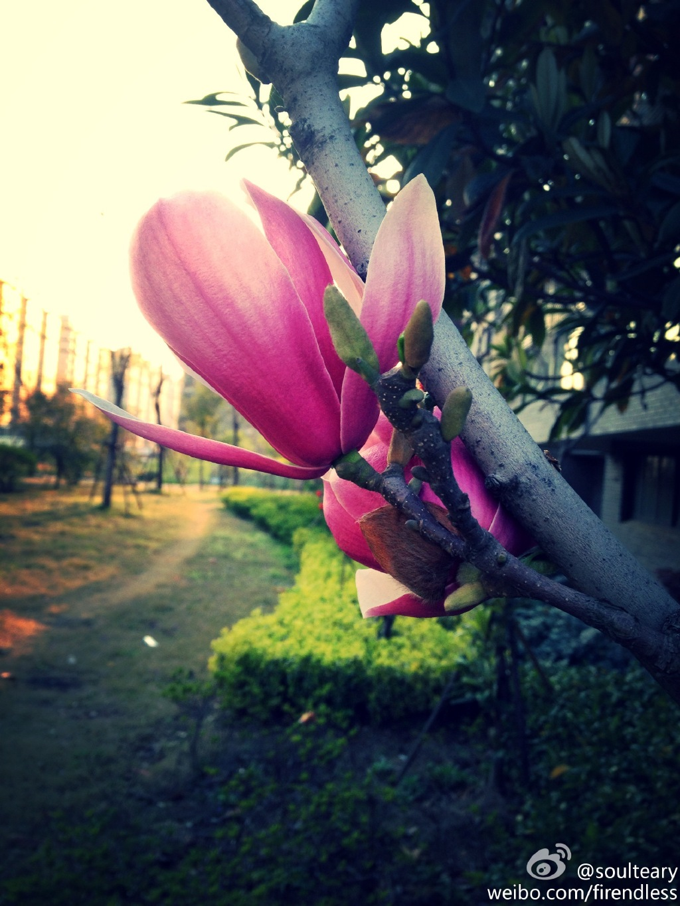
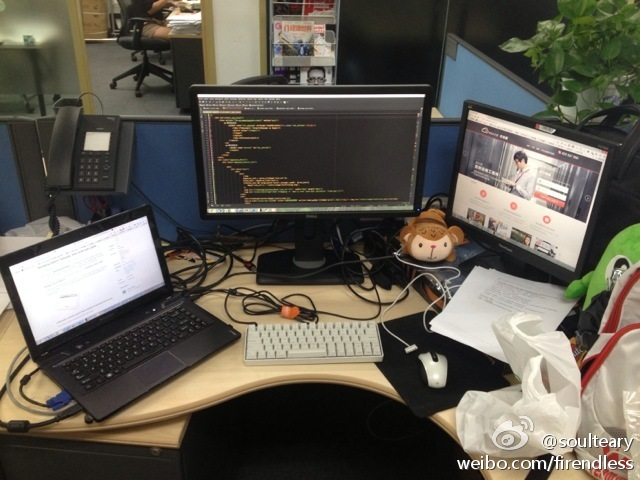
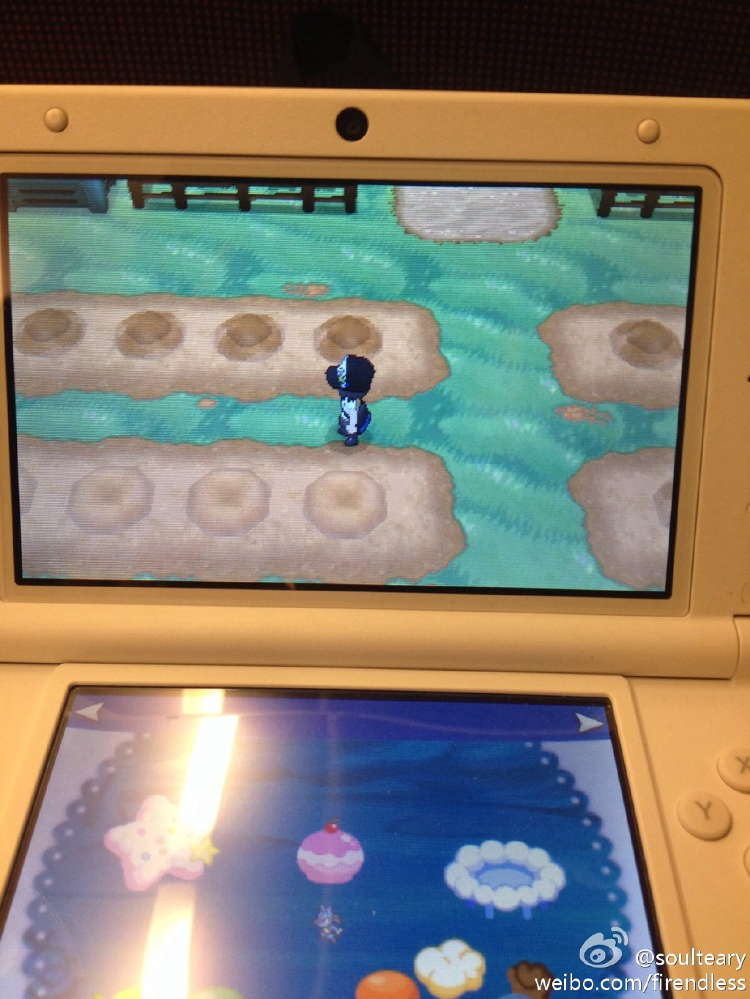
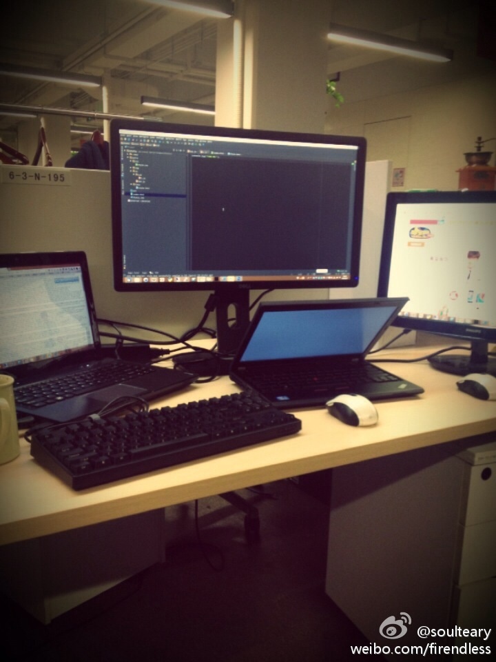
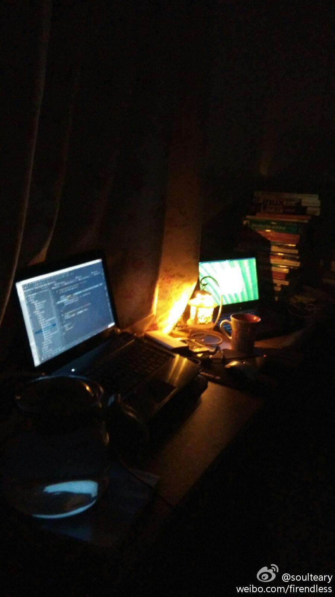
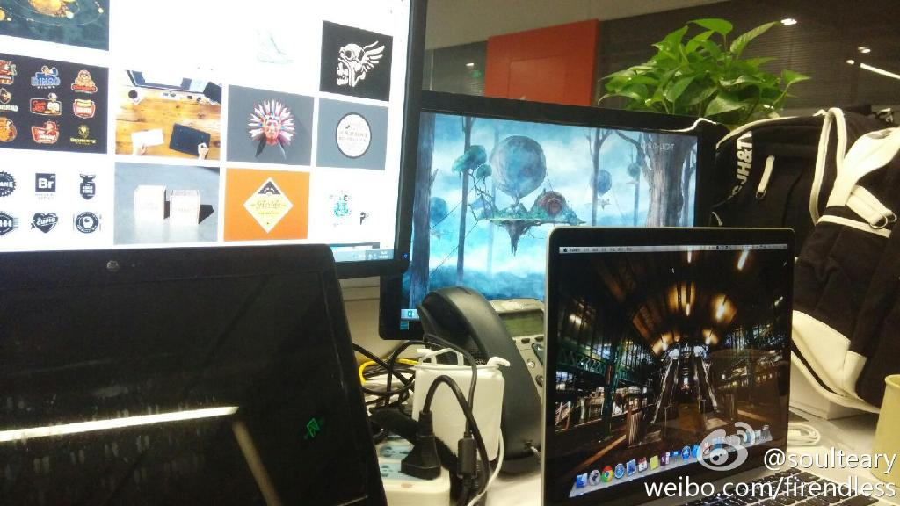
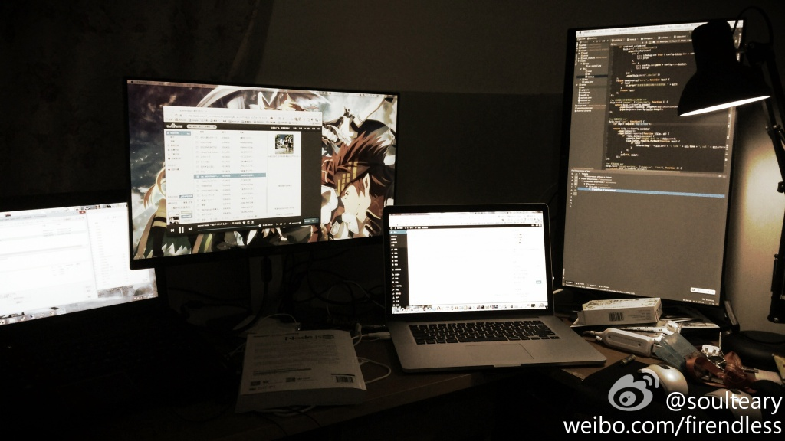
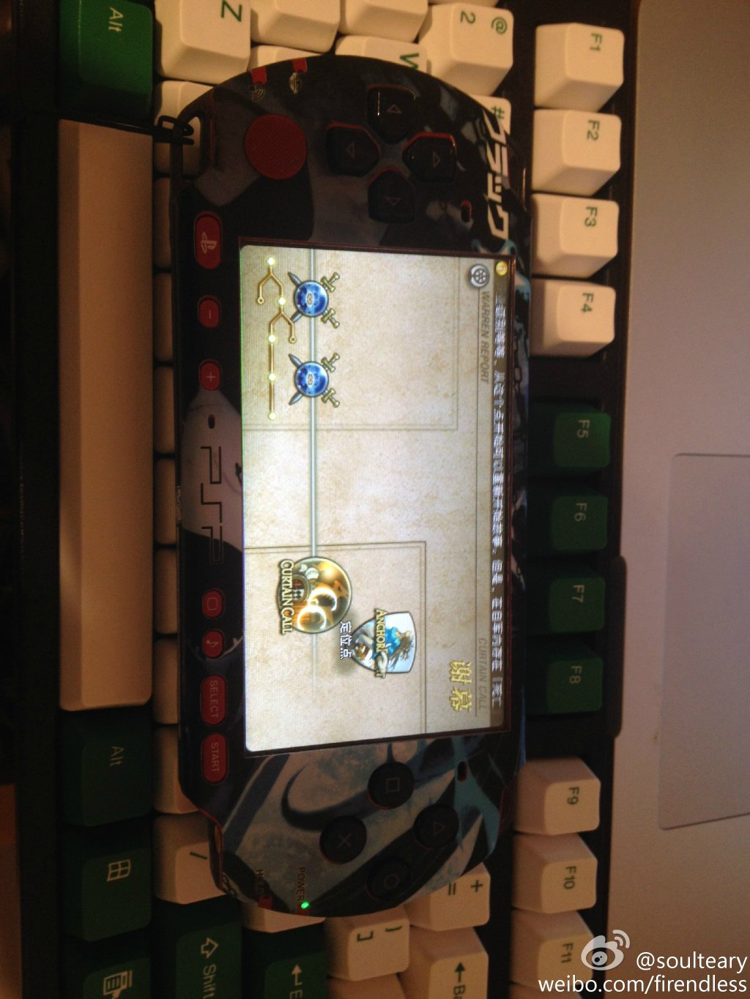
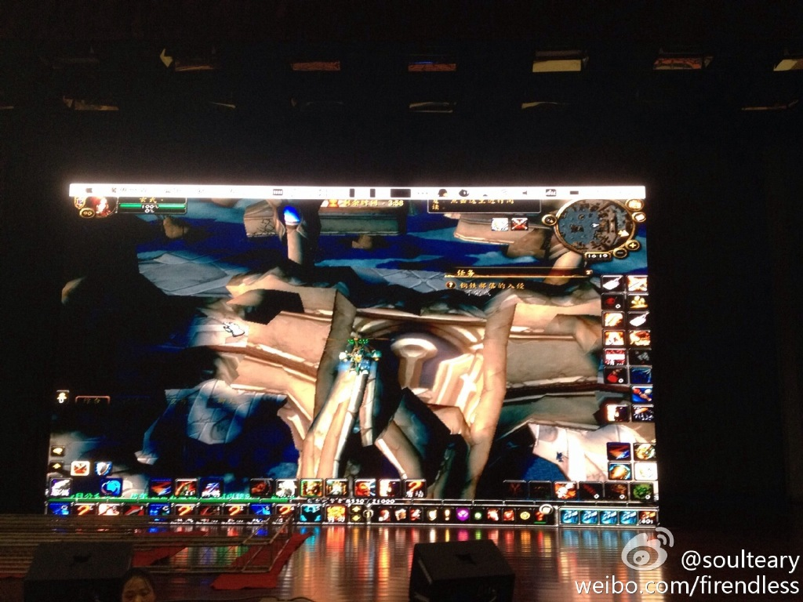

## 屏幕展示 - 受辐射历史记录

    记录一下屏幕的变化.

    [北京 - 理想国际大厦 - 新浪网](http://weibo.com/1220149481/A77C7caD1) / 屏幕多了,窗口切换就少了.

    [北京 - 海淀 - 临时的家](http://weibo.com/1220149481/AtQHR3c7x) / 小屏幕...

    [杭州 - 阿里巴巴西溪园区 - 淘宝网](http://weibo.com/1220149481/AzUoFgvXG) / 辗转到了剁手网后.

    [杭州 - 西溪北苑 - 临时的家](http://weibo.com/1220149481/B53AoaFT8) / 用另外一台笔电作为一台笔电的显示器.

    [杭州 - 阿里巴巴西溪园区 - 淘宝网](http://weibo.com/1220149481/B7M6MzOMu) / 屏幕不知不觉多了.

    [杭州 - 西溪北苑 - 临时的家](http://weibo.com/1220149481/B9aqBzmIb) / 桌面的线有点麻烦了.

    [杭州 - 西溪北苑 - 临时的家](http://weibo.com/1220149481/BnVq23imb) / 小屏幕...

    [杭州 - 阿里巴巴西溪园区 - D2会场](http://weibo.com/1220149481/Bt37ertHZ) / 如果家里有这么一块屏幕就好了

